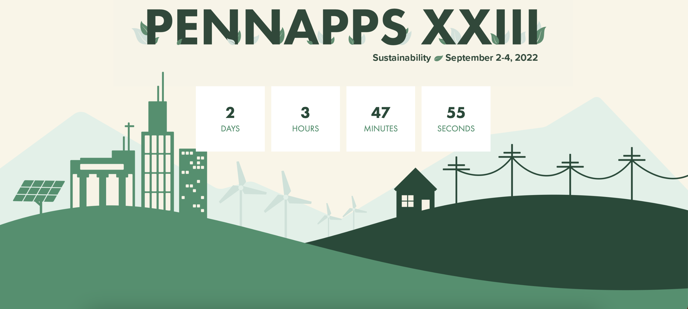

# PennApps Front-end Technical Challenge
Welcome to the PennApps front-end challenge! Your task, should you
choose to accept it, is to build a simple PennApps iteration site!

## Overview
Each year, the dev team creates a new official website for the current
iteration of the hackathon based on the creative team's designs. We call
these sites "iteration sites." In this challenge, you are to create a
simplified version of the [2022 iteration site](https://2022f.pennapps.com/).

Just like when PennApps dev members start on a new iteration site, you
are given a [Figma](https://www.figma.com/file/J0JgF3cNR5pgrTgQSsn6Sp/PennApps-Technical-Challenge---Frontend?node-id=0%3A1&t=JRzGd9rVTt2pviRb-1)
that prototypes your goal. We also recorded a [demo video](demos/figma-demo.mov)
from Figma to highlight the interactions the site should provide.
Specifically, you are to implement the following features;
* The static site, appearing as close to the Figma as possible.
* A live countdown timer that counts down until 6 pm ET on the hackathon start
date shown on the website. Once the hackathon starts, the timer should
stay at 0.
* A nav bar that sticks to the top when scrolling past the landing page
(this property is not prototyped in Figma, but you can experience it on
the official 2022 site).
  * When clicking on "PENNAPPS", the page should scroll to the top (landing page).
  * When clicking on "ABOUT", the page should scroll to the "About" section.
  * When clicking on "APPLY", the page should scroll to the "Apply" section.
* An "APPLY" button that hyperlinks to https://pennclubs.com/club/pennapps (note:
this is different from the official website's behavior).
  * When mouse is down on the button, the button should change color.

Note that although as a developer you should generally stick to design decisions,
if you are unable to implement any designed features, you may come up with a reasonable
alternative design to make up for the feature. If you have time, you can also
add your own designs and components beyond the above list to flesh out the website.
Make sure to communicate all your changes and decisions in your `README`.

## Milestones
### Milestone 1: Unstyled Static Site
Static website with all visual components but no images or moving/interactive
parts (except the button). Does not have to be styled. The title and the countdown
can be hard-coded text components. The button should hyperlink to the PennApps club
site.
### Milestone 2: Add Style and Images
Let's make the website pretty! Style the website such that it appears as close
to the Figma design as possible. The image assets can be found in [assets](assets).
### Milestone 3: The Nav Bar
Time for the scroll. Make the three items in the nav bar functional!
### Milestone 4: The Countdown Timer
Tick Tock. A reminder that time never goes negative. :D

## Submission
You should submit all your source files in addition to a `README` that contains
setup and run instructions as well as an overview of the code. If your source files
aren't organized in a ready-to-run layout in your submission, your `README` should also
include a section on how to set up the file structure. You can either send us
a zip file with all the files or a link to a GitHub repo via email.

## FAQs
* What language/framework should I use?
  * Up to you! The dev team uses Gatsby, which is a React-based framework.
  Hence, it is encouraged that you use React, but you are free to use any
  other language and/or framework of your choice.
* Can I use open source/third-party libraries?
  * Yes, but we also want to see code that you’ve written yourself! So if
  you do, make sure to cite it in the `README` and be ready to explain why
  you decided to use a specific library.
  * Banned sources: code from another applicant, or code from the official
  PennApps GitHub organization.
* How much time should I spend on this challenge?
  * Spend no more than 3 hours! You are free to spend more time playing with
  the website, but feel no pressure submitting whatever you have by the end of
  the third hour. It is not expected that you complete all the milestones.
  Just show us what you've got.
* What are you looking for from my submission?
  * We are looking for the following items, in order of decreasing weight:
    * A functional website that appears close to the Figma and contains the
    required interactions.
    * Clean, readable code (think code structure and style).
    * Easy-to-follow instructions to run the site and to add/update section
    components, in the form of a `README`.
    * Any features or design considerations you add as ECs.
* Can I make my project public on GitHub?
  * Feel free to! This is your work and I hope you feel proud of it. :)) Just
  don't share your project with another applicant this year or in the future
  years.
